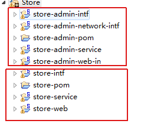
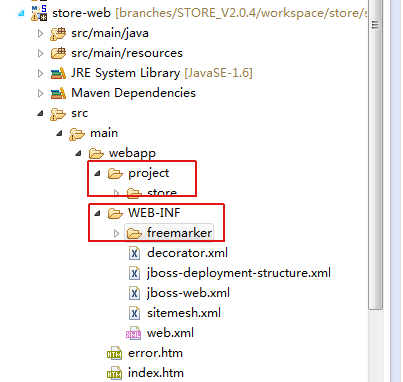
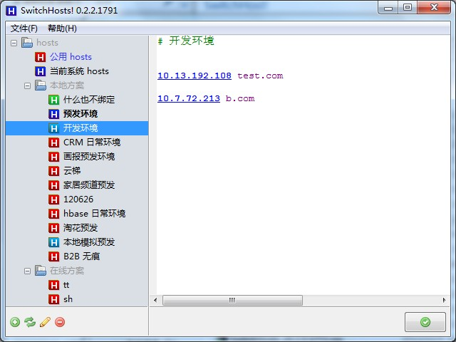

# 现有开发模式思考
2014年11月24日，苏宁V购二期项目发布生产，没有重大问题，过程比较顺利。经过V购项目的开发，我经历了一个完整的项目开发流程，V购项目的开发方式和苏宁的大多数项目相同。因此基于这个项目的一些思考和总结有一定的普遍适用性。

## 现有开发流程概述
V购项目的开发大致遵循以下流程：  
1. 项目立项，需求评审，产品文档，交互设计，视觉设计。这些都是在开发阶段直接的流程，在这些流程中，开发可以参与并提出自己的一些建议，但是不强制。一般情况下开发人员不会全部参与。  
2. 后台开发人员根据项目需求进行后台开发，包括接口开发。与此同时，前端开发开始进行静态页面的开发，还原视觉稿。  
3. 前端开发完成后，由产品，交互，视觉等对前端稿进行评审，修改其中的问题。  
4. 进入前台开发阶段。一般情况下，前台代码由开发完成，新建一个JavaScript文件，不直接修改前端JS，前端协助开发。前台开发主要围绕数据层的交互进行，将静态页赋予数据逻辑，成为实际可用的网页。  
5. 测试人员给出测试用例，并进行测试需求评审。评审通过后，一旦前台开发完成，即进入测试阶段。  
6. 测试人员严格按照测试用例进行测试，对发现的问题进行跟踪，并发起问题跟踪单，交由相应的开发人员进行bug修复并回测。所有的测试均在测试环境(sit/pre)上进行。测试人员定期向项目组全体成员以及上级领导发送测试报告，反馈测试进度。  
7. 所有测试完成并通过后项目封板，将所有需发布文件打包交由运维在预定的时间进行发布，将所有需发布资源发布至生产环境。  
8. 发布至生产环境后确认没有问题，开放入口，正式投入使用。至此，项目开发流程结束。  

## 现有开发方式的问题
### 需求评审阶段
一些需求对于前端开发来说是不方便实现的，这些方面要尽量避免。例如下面的模块，是首页的一部分：  
  
每个圆的外边框宽度为8px，而视觉稿中，两个圆之间的距离只有15px，这样都无法用CSS3或遮罩层直接实现，都要借助于JS的控制，而对于这么一个简单的效果用上JS是完全没有必要的，最后只有将圆之间的距离改为16px才得以解决。  
所以在需求评审，尤其是交互视觉评审阶段，前端尽量要参与。上述问题可能过于细致不一定能看出来，但是一些比较明显的问题尽量可以在前期就避免掉。  

### 开发阶段
#### 前端代码库管理
目前新的代码管理方式是先使用Fas构建项目目录，所有的开发全部在codeDev目录下。同时，同时通过每个目录下gruntfile.js中的配置，使用grunt将所有的代码打到codePub目录下，codePub目录是前端与开发对接的目录，开发从此目录中获取代码，再复制到自己的开发目录下进行开发。使用的代码版本管理工具是SVN。  
版本管理工具有我觉得还是Git比较好，尤其是对于前端来说。但是工具的切换需要成本，同时也需要团队成员进行学习。  
对于codePub这个对接目录，其中项目静态资源的目录有两个，分别是`demo`和`project`，demo中存放的是html文件和html中引用的一些图片之类的文件。project目录主要存放css文件和JS文件。我觉得目录结构的改变主要是为了方便开发从目录中取代码，因为开发机器上的目录结构大概是这样的：  
  
上半部分的红框目录存放后台代码，跟前端没什么关系，而前端代码是存放在`store-web`这个目录下的。store-web目录的内部结构如下：  
  
可以看到，在某级目录下代码的存放也是分为project和WEB-INF两个目录的，WEB-INF目录下存放的就是开发根据html套的freemarker模板。发布时将两个war包打到线上。  
前端和开发之间存在对接目录这么一层我觉得是受到了目前开发方式的影响。前端的静态资源除了CSS文件开发是基本不会动的以外，其他文件都是有可能被修改的，JS可能会改动，html就更不用说了。这就是协作开发方式的问题了。  

#### 前后端联调
前后端联调是我觉得在整个项目中除了前台被割裂以外最大的问题了。一旦前端代码被开发拷到开发机器上以后，前端代码的管理权基本就脱离了前端开发的掌控范围。如果开发比较守规矩，在任何改动之前都通知前端，或者让前端修改后提交再由开发拉代码的话还好，万一遇到一些比较放荡不羁爱自由的开发，不跟前端通知一声就直接改代码，用不了多久，前端就会发现开发用的代码和自己提交的一点不一样了，万一出现什么开发不能解决的bug，让前端看代码前端还要看一阵子才能上手，还有出错的可能。  
所以我觉得，在最终测试——这里的最终测试是指bug都清完了以后的预发布阶段——之前，前端的代码应该始终由前端来控制，而一些改动不会很大的图片资源可以先保存在开发环境中。开发在页面中引用前端代码的时候，不需要去引开发环境中的代码，直接获取前端机器上的代码就行，前端要做的只是一个nginx的配置。如果嫌每次都要在页面中把前端的IP地址写进去麻烦，可以直接把url写成发布后的生产url，然后配置hosts就行，这里可以使用一个工具叫做Switchhosts：  
  
这个工具比用fiddler进行重定向还要方便一些，可以瞬间切换。而且用了这个方法以后，不仅前端代码可以不用提交到开发机器上，甚至所有的接口都不用上到测试环境上。这在一些大项目上会尤其好用，开发各自管理自己的接口，只要自己的IP不变就行。测试的时候将所有的接口上线到测试环境，前端代码依然可以自己管理，让测试人员直接绑上前端IP就可以测。而测试环境测试作为bug全清后最后的确认。这样，前端代码有任何修改也不需要专门发布一次再测了，因为前端各种奇怪的问题会比较多，代码会经常改动，减少不断发布的次数可以大大提高联调测试的效率。  

#### 前后端独立
上面说的前后端联调方式的实现实际上还是依赖于一个重要的方面，那就是前台代码能够被前端掌控，只有前台代码也是由前端来写，才能真正消除掉其中的沟通成本和出错可能。这里的前后端独立和前后端分离还是不一样的概念，前后端分离目前我们的距离还比较远，但是前后端独立应该是可以推行的。  
**前后端独立的标准：**  
1. 只要是在浏览器中运行的JS代码，应该都是由前端来写。没有人能比前端更了解JS，JS入门简单，很多开发都能写一点JS，但是他们习惯了Java的开发方式，写出来的JS有很多不合理的地方，代码执行性能很低。JS不像Java，它不需要预编译，而是在浏览器的JS引擎中执行，因此对代码性能非常敏感。低效的JS代码会直接影响页面的性能。  
2. 前台代码和前端代码只是在代码的作用上有所区分，而并非有必要完全分割成两个文件，现在大量项目中的JS文件是分离的。所谓的分离应该是在代码逻辑层面上降低耦合度，这种文件级别的分离没有什么必要，尤其是在模块化还没有推动起来的时候，增加一个请求也是没有必要的。

前后端独立中有一个重要的问题是前端模板由谁来维护，这要联系到资源的发布问题上去了。

因此，**联调**和**独立**是我觉得在前后端开发方式上可以改进的地方，步子也没有迈得太大。

### 发布阶段
这次V购的发布我没有参与，前端本来就不参与，但是开发同样不参与，而是让运维来负责，这个我觉得不太合理。运维的工作职责是网络平台的维护优化，当然他们知道如何发布，也有发布权限，但是他们不了解项目，项目出了任何问题他们都无法解决，而开发又不在的情况下怎么办呢？现在的发布方式是先发布到生产，但是不开放入口，也就是非覆盖式发布，这样即使出错，用户也不一定会发现。不知道是否有覆盖式发布的情况，一旦发布，线上的访问结果会即时替换，在那种情况下开发不参与发布就非常危险了。  

理想的情况是开发和前端有各自的发布权限，各自发布自己的资源。前百度工程师张云龙针对发布的问题做过[解释](http://www.zhihu.com/question/20790576/answer/32602154)，其中有很多值得借鉴的地方。

#### 发布顺序
资源和页面的发布顺序的问题，张云龙的文章里已经说得比较清楚了，实际上就是在覆盖式发布的情况下会出现页面样式错乱的问题。我觉得解决这个问题主要在于两点——**非覆盖式发布**和**静态资源提前上线**。

首先是静态资源提前上线，提前将静态资源部署到CDN节点上，确保可以访问。然后是页面的上线，全新的页面不存在什么问题，如果是对旧页面的更新，则需要对其中所有静态资源的引用进行更新。现在的更新策略是在资源后加版本号：`http://script.suning.cn/javascript/SFE.base.js?v=20141113030806`，这个过程是手动的，存在出错的可能。除了加版本号，也可以在文件名中硬编码MD5戳，都是防缓存影响的方法。FIS中对两种方式都有支持，这个并不是难点，难点在于如何更新页面中对应的版本号或是MD5戳。

现在就回到上一段最后的问题，前端模板由谁来维护。按照现有的模式由开发维护模板的话，就无法自动根据静态资源的更新而更新引用路径，折衷的办法是，前台开发由前端接管的前提下，使用自动化工具更新引用路径并测试，在最后的发布阶段将html交给开发。但这样无法解决已上线页面的引用路径更新问题。最好的情况就是模板由前端控制，这样页面中的所有引用路径都可以自动更新，但受制于现有的开发模式，这样的改变可能比较困难。
